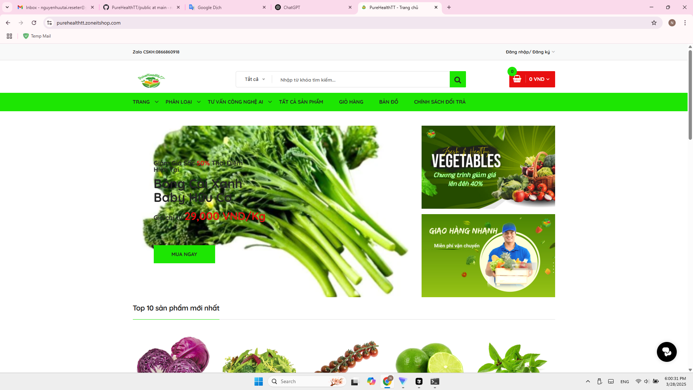
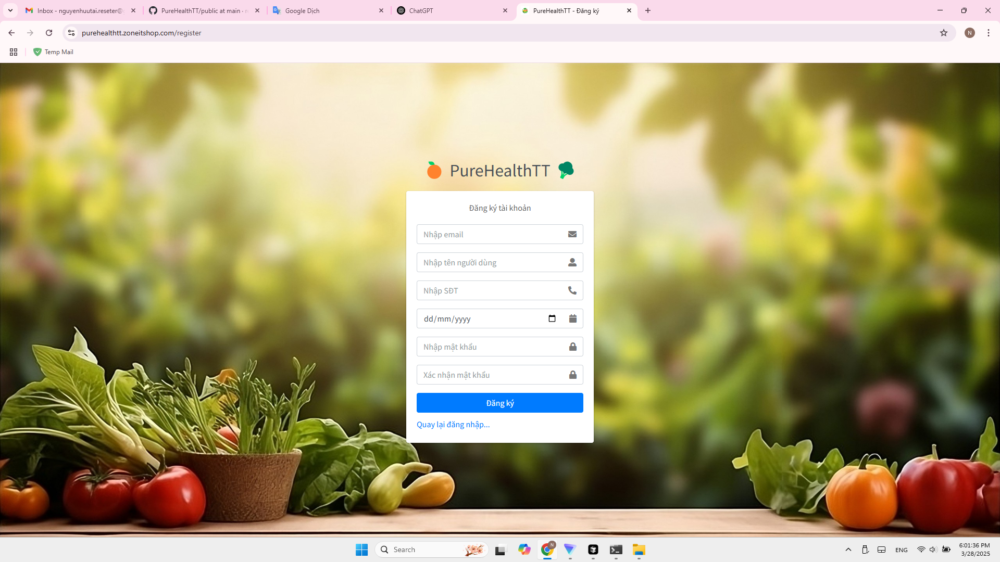
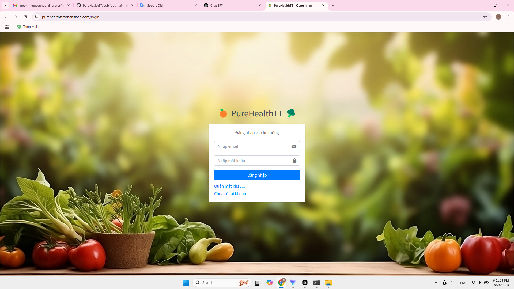
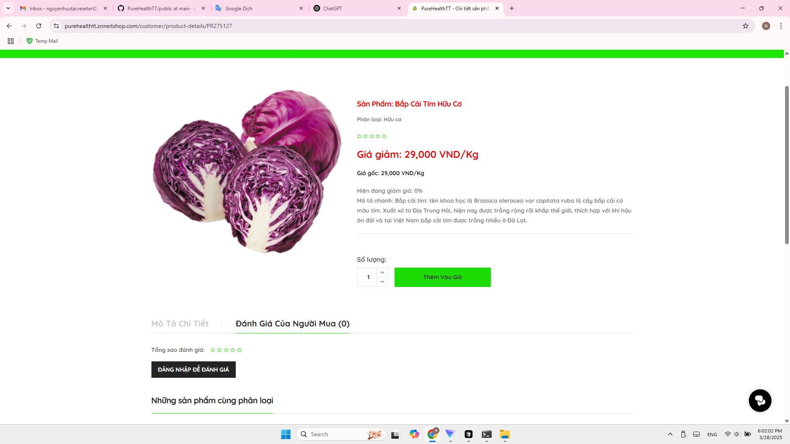
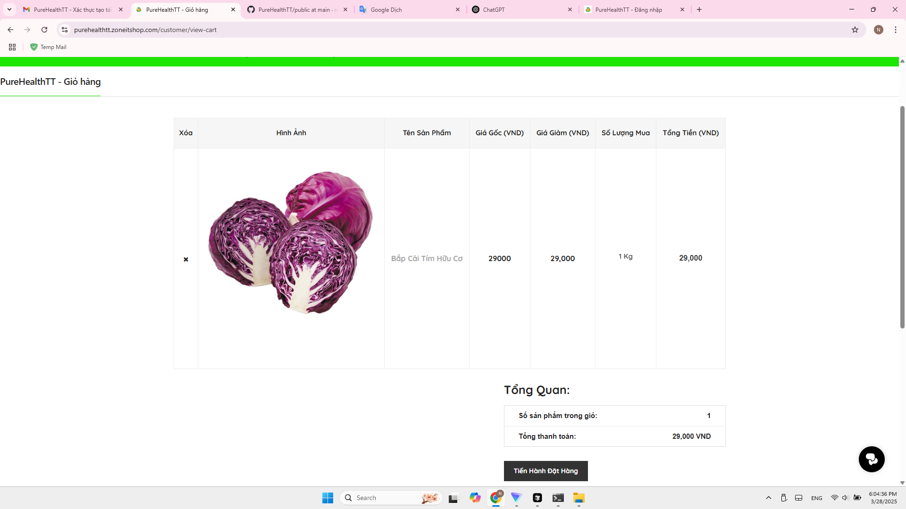
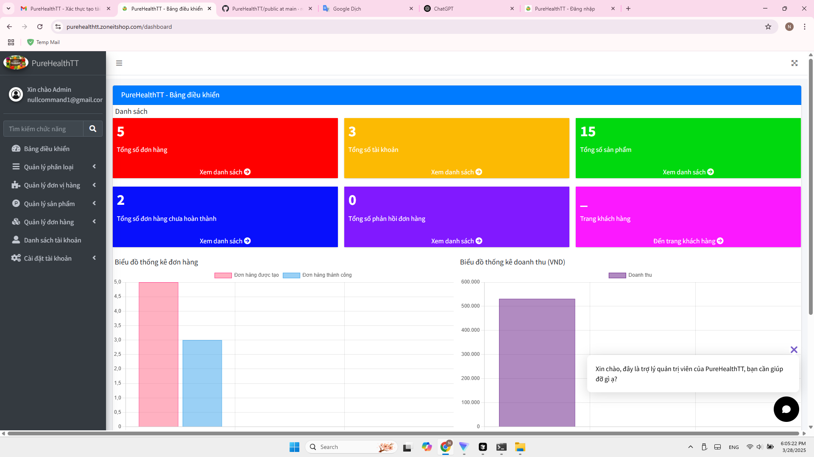
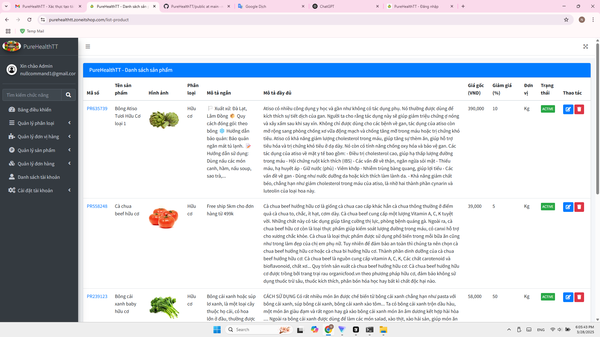
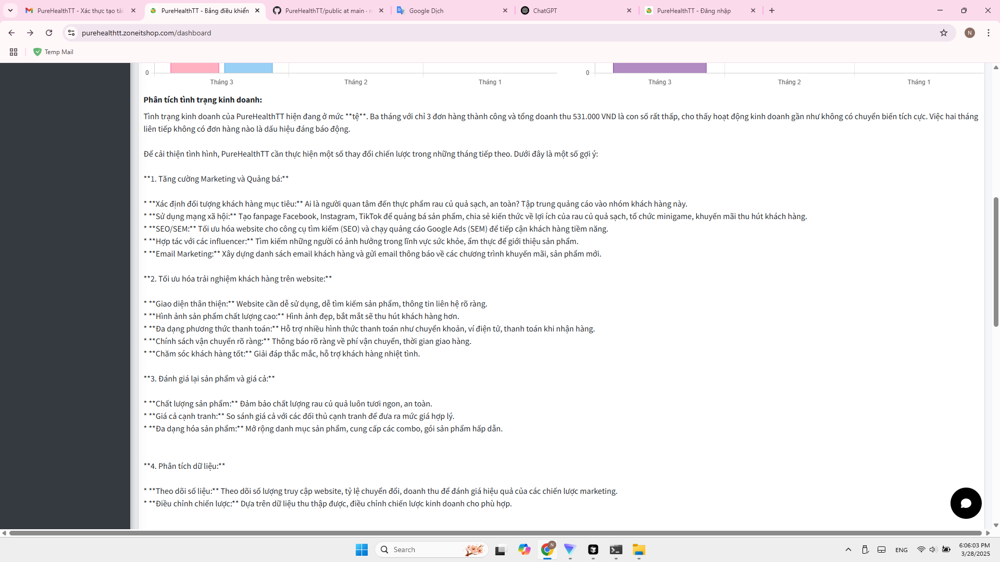

# PureHealthTT

## Giới thiệu

PureHealthTT là một trang thương mại điện tử đơn giản bán thực phẩm rau củ quả được xây dựng dựa trên Laravel với đầy đủ các tính năng cần thiết.

## Tính năng chính

- Đăng ký, đăng nhập.
- Quản lý sản phẩm.
- Quản lý đơn hàng.
- Quản lý khách hàng.
- Tìm kiếm sản phẩm.
- Thêm vào giỏ hàng.
- Thanh toán.
- Quản lý đơn hàng.
- Quản lý khách hàng.
- Tìm kiếm sản phẩm.
- Đánh giá sản phẩm.
- Quản lý báo cáo.
- Nhiều hơn nữa...


## Công nghệ

- PHP Laravel
- MySQL
- JavaScript/jQuery
- Bootstrap

## Yêu cầu hệ thống

- PHP >= 8.0
- Composer
- MySQL/MariaDB

## Cài đặt

```bash
git clone https://github.com/reseter1/PureHealth.git

cd PureHealth

composer install

php artisan key:generate

php artisan migrate

php artisan serve
```

## Demo

Dưới đây là một số hình ảnh demo của hệ thống:

### Giao diện trang chủ


### Giao diện đăng ký


### Giao diện đăng nhập


### Giao diện chi tiết sản phẩm


### Giao diện giỏ hàng


## Giao diện quản trị


### Quản lý sản phẩm


### Thống kê báo cáo

